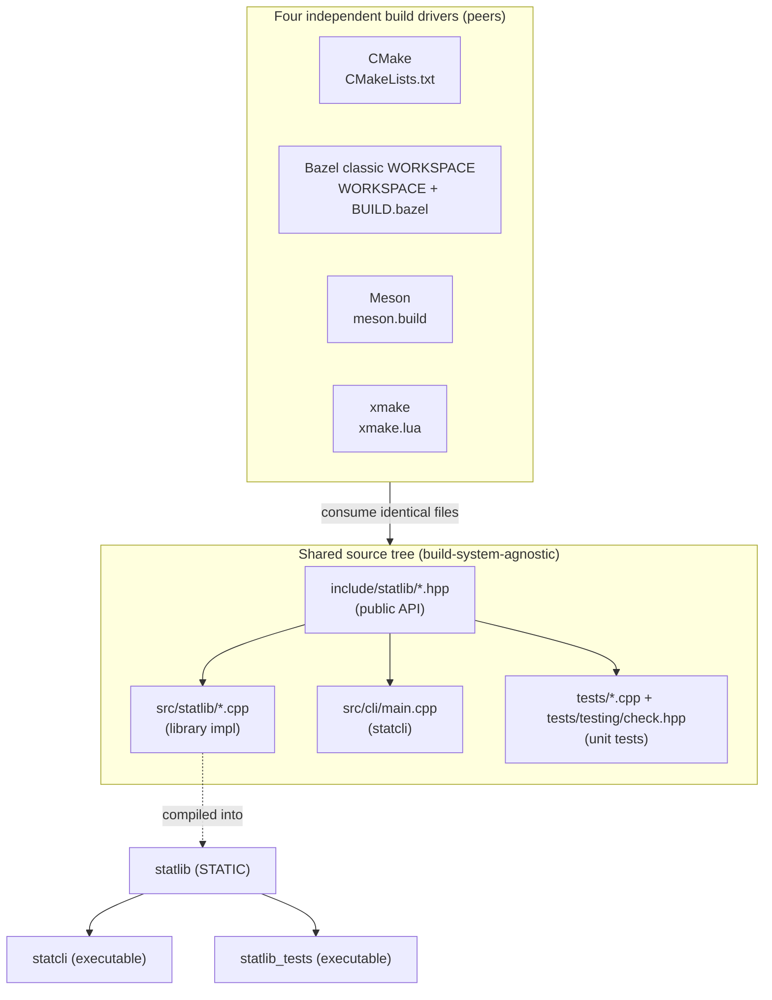

# Design Document Specification — cpp-build-systems-compared

**Project:** cpp-build-systems-compared
**Tagline:** "Same source, different builds."
**Source SRS:** `docs/requirements/SRS.md`
**Status:** Ready for the C++ Developer agent to implement
**Last updated:** 2026-10-03

---

## 0. Resolved Open Questions (SRS §8)

These are binding design decisions. Each with >1 reasonable option states the trade-off.

| OQ | Decision | Rationale / Trade-off |
|----|----------|-----------------------|
| **OQ-1** Empty-input contract | Library functions that **require** non-empty input (`mean`, `population_variance`, `population_stddev`, `min`, `max`, `median`) **throw `std::invalid_argument`**. `sum` is defined on empty input and returns `0.0`. | Throwing keeps the happy-path API clean (plain `double` returns, no `std::optional` unwrapping in the CLI and tests). Alternative `std::optional`/error-code returns were rejected: they force every caller/test to branch and obscure the trivial math. Cost: callers must wrap in try/catch — acceptable and explicitly tested (FR-13). `sum([]) == 0` follows the mathematical identity (empty sum = additive identity) and is the single principled exception. |
| **OQ-2** CLI input mechanism | **Primary: read whitespace-separated `double` tokens from `stdin`** until EOF. No argv numeric parsing. | Stdin is trivially testable with a pipe/heredoc and has no argv length limits. argv-based input was rejected as the primary because it complicates shell-level testing (quoting, per-system arg handling). One mechanism only — keeps all four build systems' test wiring identical. |
| **OQ-3** CLI output format | Fixed **`key: value`** lines, one metric per line, fixed order, `std::setprecision(6)` with `std::defaultfloat`. Exact spec in §4.2. | `key: value` is both human-readable (FR-9) and byte-assertable by QA. A pretty aligned table was rejected: harder to assert and locale/width sensitive. |
| **OQ-4** Test harness | **Hand-rolled, vendored single header** `tests/testing/check.hpp` providing `CHECK`, `CHECK_NEAR`, `CHECK_THROWS`, a registry, and a `STATLIB_TEST_MAIN()` macro that returns non-zero on any failure. No external framework. | Fully satisfies NFR-7 / AC-10 with ~1 file and zero network. A third-party single-header (e.g. doctest) was rejected to guarantee nothing is fetched and to keep licensing trivial (our own MIT header). |
| **OQ-5** clang++ 18 support | **Bonus matrix dimension, not a deliverable.** g++ 13.3 is the only required compiler (NFR-4). Design keeps sources compiler-agnostic (NFR-8) so clang works for free. | Matches SRS risk posture; avoids per-system clang toolchain config work in the critical path. |
| **OQ-6** Static vs shared | **STATIC library** in all four build systems. | Static linking is the lowest-friction path that behaves identically across CMake/Bazel/Meson/xmake, needs no RPATH/`LD_LIBRARY_PATH` handling for `statcli`/tests, and keeps the comparison about build systems, not packaging. Shared/both rejected to avoid per-system SONAME/visibility divergence. "static vs shared" is itself noted as a *potential* matrix dimension, not exercised. |

---

## 1. Architecture Overview

Three logical components, one shared source tree, four parallel build drivers. The build systems
are **peers**: each independently consumes the *same* `include/`, `src/`, and `tests/` files and
produces its three targets in its own isolated build directory.

### 1.1 Component diagram



### 1.2 Dependency rules (clean architecture)

- `statlib` depends on **nothing** but the C++17 standard library.
- `statcli` depends on `statlib` **only** (no duplicated math — FR-11).
- `statlib_tests` depends on `statlib` + the vendored header **only**.
- No source file contains build-system `#ifdef`s or conditional source selection (NFR-8).
- Header coupling is minimized: each public header pulls in only `<vector>` (and `<stdexcept>`
  is an implementation concern, not needed in headers).

---

## 2. Directory Layout (exact file list)

```
cpp-build-systems-compared/
├── LICENSE                         # existing (MIT)
├── .gitignore                      # existing — extend to ignore all build dirs (see §5)
├── README.md                       # trade-off matrix (Technical Writer; skeleton in §6)
│
├── include/
│   └── statlib/
│       ├── statistics.hpp          # full public API (all functions)
│       └── version.hpp             # STATLIB_VERSION string (optional, CLI banner)
│
├── src/
│   ├── statlib/
│   │   └── statistics.cpp          # implementation of all statistics functions
│   └── cli/
│       └── main.cpp                # statcli entry point
│
├── tests/
│   ├── testing/
│   │   └── check.hpp               # vendored, hand-rolled assertion harness (MIT)
│   └── statistics_test.cpp         # unit tests (includes testing/check.hpp)
│
├── CMakeLists.txt                  # CMake driver (single top-level file)
├── WORKSPACE                       # Bazel classic — empty-ish, see §3.2 (BR-8)
├── BUILD.bazel                     # Bazel targets (single top-level file)
├── meson.build                     # Meson driver (single top-level file)
├── xmake.lua                       # xmake driver (single top-level file)
│
└── docs/
    ├── requirements/SRS.md         # existing
    └── design/DESIGN.md            # this document (after move)
```

**Design choice — flat, single-file-per-build-system drivers:** Each build system's top-level
file lives at the repo root and references sources by relative path. Their names never collide
(`CMakeLists.txt`, `WORKSPACE`+`BUILD.bazel`, `meson.build`, `xmake.lua`), so no subdir split is
needed. Trade-off: a single root `BUILD.bazel`/`meson.build` is simplest for a project this size;
per-directory build files (idiomatic Bazel/Meson) were rejected as unnecessary ceremony that would
*increase* the lines-of-config comparison noise. (The Technical Writer may note this in MR-2 row 2.)

> **No per-build-system source copies** (AC-1 / BR-4): all four drivers list the *same* paths above.

---

## 3. Module Boundaries & Public API

### 3.1 `include/statlib/statistics.hpp`

All functions in namespace `statlib`. Input is always `const std::vector<double>&`. Functions that
require non-empty input throw `std::invalid_argument` (documented per-function). Signatures only —
**no implementation here**.

```cpp
#pragma once
#include <vector>

namespace statlib {

// Sum of all values. Defined for empty input: returns 0.0.
double sum(const std::vector<double>& data);

// Number of elements. Convenience; defined for empty input: returns 0.
std::size_t count(const std::vector<double>& data);

// Arithmetic mean. Throws std::invalid_argument if data is empty.
double mean(const std::vector<double>& data);

// Population variance (divisor N). Throws std::invalid_argument if data is empty.
double population_variance(const std::vector<double>& data);

// Population standard deviation (sqrt of population_variance).
// Throws std::invalid_argument if data is empty.
double population_stddev(const std::vector<double>& data);

// Minimum value. Throws std::invalid_argument if data is empty.
double min(const std::vector<double>& data);

// Maximum value. Throws std::invalid_argument if data is empty.
double max(const std::vector<double>& data);

// Median (average of two middle elements for even counts).
// Does NOT assume sorted input; computes on a local copy.
// Throws std::invalid_argument if data is empty.
double median(const std::vector<double>& data);

} // namespace statlib
```

**Contracts & semantics (binding for the developer):**

- **Error type:** `std::invalid_argument` with a message naming the function, e.g.
  `"statlib::mean: empty input"`. CLI need not parse the message.
- **Population (not sample) variance/std-dev:** divisor is `N` (FR-2 says "population"). Sample
  variance (N−1) is explicitly **out of scope**.
- **`median` must not mutate its argument:** it sorts a local copy (`std::nth_element` or
  `std::sort` on a copy). Rationale: value-in/const-ref keeps the function pure and testable.
- **Ownership model:** pure value semantics. Inputs are `const` references (no ownership transfer);
  all returns are plain `double`/`std::size_t`. No `new`/`delete`, no smart pointers — there is no
  heap-owning state in `statlib`. This is deliberately the simplest RAII posture (no resources).
- **Threading:** all functions are pure and stateless → trivially thread-safe (reentrant). No
  shared mutable state anywhere in the library.
- **Header minimality:** header includes only `<vector>` and `<cstddef>` (for `std::size_t`).
  `<stdexcept>`, `<algorithm>`, `<numeric>`, `<cmath>` are implementation-only includes in the
  `.cpp`, keeping translation-unit coupling low.

### 3.2 `include/statlib/version.hpp` (optional)

```cpp
#pragma once
namespace statlib { inline constexpr const char* kVersion = "0.1.0"; }
```
Used only for an optional CLI banner line; not required by any FR. Keep or drop at developer's
discretion (if dropped, remove the `version:` line from §4.2).

### 3.3 `tests/testing/check.hpp` — vendored test harness (spec)

Hand-rolled, single header, **MIT** (carry a short license header — NFR-9). Design:

- A file-static vector of registered test functions (function pointers / `std::function`).
- `STATLIB_TEST(name)` macro: defines a test function and self-registers it via a static
  initializer object at namespace scope.
- Assertion macros (each records a failure and `continue`s the current test, or short-circuits —
  see below; they must **not** `throw` out of the harness except `CHECK_THROWS`):
  - `CHECK(expr)` — fail if `expr` is false.
  - `CHECK_NEAR(a, b, eps)` — fail if `std::fabs((a)-(b)) > (eps)` (FR-14).
  - `CHECK_THROWS(expr, ExceptionType)` — fail if evaluating `expr` does not throw `ExceptionType`.
  - On failure, print `FAIL: <file>:<line>: <message>` to `stderr` and increment a global/counter.
- `STATLIB_TEST_MAIN()` macro: expands to a `main()` that runs all registered tests, prints a
  `PASSED n / FAILED m` summary, and **returns `EXIT_FAILURE` (non-zero) iff any assertion failed**
  (FR-15 / AC-12), else `EXIT_SUCCESS`.
- Zero dependencies beyond `<iostream>`, `<vector>`, `<functional>`, `<string>`, `<cmath>`,
  `<cstdlib>`. No TLS, no threads, no I/O files.

**Trade-off:** registry-based (self-registering) tests vs. a single `main` with inline asserts.
Registry chosen so adding a test case is one macro with no edits to `main()`, matching how real
frameworks feel while staying ~80 lines. Cost: a little macro machinery in one vendored file —
acceptable and isolated.

---

## 4. `statcli` Design

### 4.1 Behavior

1. Read **all** whitespace-separated tokens from `stdin` using `operator>>` into `double`.
2. If a token fails to parse as a `double` (stream failbit without EOF) → print an error to
   `stderr` and exit **non-zero** (FR-10). Message: `error: non-numeric input` (exact).
3. If **zero** tokens were read (empty input) → print `error: empty input` to `stderr`, exit
   non-zero (FR-10, ties to OQ-1). The CLI checks emptiness *before* calling throwing functions;
   it also wraps `statlib` calls in try/catch as defense-in-depth and maps `std::invalid_argument`
   to `error: <what()>` + non-zero exit.
4. Otherwise compute via `statlib` and print the block in §4.2 to **stdout**, exit `0`.

**Design choice:** CLI pre-validates emptiness AND catches exceptions. Rationale: deterministic
`stderr` messages for QA, while still proving the library's throw contract is survivable end-to-end.

### 4.2 Exact output format (stdout, success case)

One `key: value` per line, this exact order, `std::setprecision(6)` with default float formatting.
`count` is an integer; all others are doubles.

```
count: <int>
sum: <double>
mean: <double>
min: <double>
max: <double>
median: <double>
stddev: <double>
```

Formatting rules (binding for QA assertions):
- Stream manipulators: `std::cout << std::setprecision(6);` once at start (default float notation,
  **not** `std::fixed`). So `4` prints `4`, `3.5` prints `3.5`, `2.236068...` prints `2.23607`.
- Exactly one trailing newline after the last line (`stddev`).
- Keys are lowercase, followed by `": "` (colon + single space).
- No `version:` line in the asserted block (keep the optional banner, if any, on `stderr` so it
  never pollutes assertable stdout).

**Worked example** (input `1 2 3 4 5` on stdin):
```
count: 5
sum: 15
mean: 3
min: 1
max: 5
median: 3
stddev: 1.41421
```
(Population stddev of 1..5 = sqrt(2) ≈ 1.41421.) QA/tests may assert this byte-for-byte.

---

## 5. CMake / Bazel / Meson / xmake Target Mapping

### 5.1 Target mapping table

Three logical targets per system: **statlib (STATIC lib)**, **statcli (exe)**, **statlib_tests (exe)**.

| Logical target | CMake | Bazel (classic WORKSPACE) | Meson | xmake |
|----------------|-------|---------------------------|-------|-------|
| **statlib** (static) | `add_library(statlib STATIC src/statlib/statistics.cpp)` + `target_include_directories(statlib PUBLIC include)` | `cc_library(name="statlib", srcs=["src/statlib/statistics.cpp"], hdrs=glob(["include/statlib/*.hpp"]), includes=["include"], linkstatic=True)` | `statlib = static_library('statlib', 'src/statlib/statistics.cpp', include_directories: include_directories('include'))` | `target("statlib")` → `set_kind("static")`, `add_files("src/statlib/statistics.cpp")`, `add_includedirs("include", {public=true})` |
| **statcli** (exe) | `add_executable(statcli src/cli/main.cpp)` + `target_link_libraries(statcli PRIVATE statlib)` | `cc_binary(name="statcli", srcs=["src/cli/main.cpp"], deps=[":statlib"])` | `executable('statcli', 'src/cli/main.cpp', link_with: statlib, include_directories: inc)` | `target("statcli")` → `set_kind("binary")`, `add_files("src/cli/main.cpp")`, `add_deps("statlib")` |
| **statlib_tests** (exe) | `add_executable(statlib_tests tests/statistics_test.cpp)` + `target_link_libraries(... PRIVATE statlib)` + `target_include_directories(... PRIVATE tests)` | `cc_test(name="statlib_tests", srcs=["tests/statistics_test.cpp"], deps=[":statlib"], includes=["tests"])` | `test_exe = executable('statlib_tests', 'tests/statistics_test.cpp', link_with: statlib, include_directories: [inc, include_directories('tests')])` | `target("statlib_tests")` → `set_kind("binary")`, `add_files("tests/statistics_test.cpp")`, `add_deps("statlib")`, `add_includedirs("tests")` |
| **test registration / run** | `enable_testing()` + `add_test(NAME statlib_tests COMMAND statlib_tests)` → run with `ctest` | `cc_test` target is runnable via `bazel test //:statlib_tests` (exit code = pass/fail) | `test('statlib_tests', test_exe)` → run with `meson test` | `add_tests("default", {kind="test"})` on the test target (or run the binary) → `xmake test` / `xmake run statlib_tests` |

**Notes:**
- `include/` is a **PUBLIC/transitive** include dir of `statlib` so `statcli` and tests inherit it;
  `tests/` is **PRIVATE** to the test target only (so `testing/check.hpp` isn't leaked).
- All four set **C++17**: CMake `target_compile_features(statlib PUBLIC cxx_std_17)` (or
  `set(CMAKE_CXX_STANDARD 17)`); Bazel `copts=["-std=c++17"]` (or `.bazelrc` `build --cxxopt=-std=c++17`);
  Meson `project(..., default_options: ['cpp_std=c++17'])`; xmake `set_languages("c++17")`.
- **Static linking everywhere** (OQ-6): CMake `STATIC`, Bazel `linkstatic=True` on the lib +
  default static dep linking, Meson `static_library`, xmake `set_kind("static")`.

### 5.2 Bazel WORKSPACE constraint (BR-8)

- Repo uses **classic WORKSPACE mode**: a `WORKSPACE` file present at root (may contain only
  `workspace(name = "cpp_build_systems_compared")`), and **no `MODULE.bazel`**.
- Add a `.bazelrc` line `common --noenable_bzlmod` (or `build --enable_bzlmod=false`, version
  dependent) to force classic mode on Bazel versions that default to bzlmod. Flag to developer:
  verify the exact flag against the locally installed Bazel; functionality (not flag spelling) is
  the requirement.
- No `http_archive`/external repos → stays fully offline (BR-6).

---

## 6. Build / Run Command Reference (canonical, out-of-source)

All commands run from repo root. `meson` and `xmake` are in `~/.local/bin` (ensure on `PATH`).

| System | Configure | Build | Test |
|--------|-----------|-------|------|
| **CMake** | `cmake -S . -B build-cmake -DCMAKE_BUILD_TYPE=Release` | `cmake --build build-cmake` | `ctest --test-dir build-cmake --output-on-failure` |
| **Bazel** | *(none — configured by BUILD files)* | `bazel build //...` | `bazel test //:statlib_tests --test_output=errors` |
| **Meson** | `meson setup build-meson` | `meson compile -C build-meson` | `meson test -C build-meson --print-errorlogs` |
| **xmake** | `xmake config -o build-xmake` (or default) | `xmake` | `xmake test` (or `xmake run statlib_tests`) |

Run the CLI (example):
- CMake: `echo "1 2 3 4 5" | ./build-cmake/statcli`
- Bazel: `echo "1 2 3 4 5" | bazel run //:statcli` (or run `bazel-bin/statcli`)
- Meson: `echo "1 2 3 4 5" | ./build-meson/statcli`
- xmake: `echo "1 2 3 4 5" | xmake run statcli`

**Compiler selection (g++ default, clang optional — NFR-4/OQ-5):**
- CMake: `-DCMAKE_CXX_COMPILER=clang++`
- Bazel: `--action_env=CC=clang --action_env=CXX=clang++` (or a `CC`/`CXX` env)
- Meson: `CXX=clang++ meson setup build-meson-clang`
- xmake: `xmake f --toolchain=clang`

### 6.1 Isolated build dirs & `.gitignore` (BR-5 / NFR-6 / AC-9)

Each system writes only to its own dir. Extend `.gitignore` to include:
```
/build-cmake/
/build-meson/
/build-xmake/
/.xmake/
/bazel-*          # bazel-bin, bazel-out, bazel-testlogs, bazel-<workspace> symlinks
```
> **xmake note:** xmake's default output dir is `build/` with state in `.xmake/`. Pass an explicit
> `-o build-xmake` (or accept `build/`) and ignore both `build*/` and `.xmake/`.
> **Bazel note:** Bazel outputs go to an external cache plus repo-root `bazel-*` symlinks; only the
> symlinks appear in `git status`, so ignoring `bazel-*` is sufficient (BR-5 satisfied).

---

## 7. Trade-off Matrix Skeleton (for the Technical Writer — MR-2)

Design-level skeleton only; the Technical Writer fills real data (MR-3/MR-4: state method for
measured rows, one-line justification for qualitative rows).

| Dimension (MR-2) | CMake | Bazel | Meson | xmake |
|------------------|-------|-------|-------|-------|
| 1. Config language / syntax (declarative vs imperative) | | | | |
| 2. Verbosity / lines-of-config (same lib+CLI+tests) | | | | |
| 3. Clean (cold) build speed | | | | |
| 4. Incremental (warm) build speed after 1-file change | | | | |
| 5. Dependency-handling model (how a 3rd-party dep *would* be added) | | | | |
| 6. Built-in test integration | | | | |
| 7. IDE/tooling support (`compile_commands.json`) | | | | |
| 8. Learning curve / ergonomics (qualitative) | | | | |
| 9. Cross-platform support (qualitative) | | | | |
| 10. Isolation / out-of-source footprint | | | | |
| 11. Installation / availability (how obtained; version) | | | | |

Verified versions to populate row 11 (from SRS C-2): CMake 3.28.3, Bazel (classic WORKSPACE),
Meson 1.12.1 + ninja 1.11.1, xmake 3.1.1; g++ 13.3, clang++ 18.

---

## 8. Testability Check

- **No singletons / global mutable state:** `statlib` is pure functions over value inputs →
  directly unit-testable with no mocking (FR-12..FR-14).
- **Dependency injection at the only boundary (stdin/stdout):** `statcli` logic is thin; the math
  is entirely in `statlib`, so CLI I/O can be exercised via process-level pipe tests (echo | statcli)
  without mocking a stream abstraction. (If deeper CLI unit testing is later desired, factor the
  core into a `run(std::istream&, std::ostream&)` free function — noted as an optional refinement,
  not required by the SRS.)
- **Throw contract is observable:** `CHECK_THROWS` verifies `std::invalid_argument` on empty input
  (FR-13); AC-12 negative test is achievable by flipping one expected value and confirming non-zero
  exit.
- **Float tolerance:** `CHECK_NEAR(..., 1e-9)` default epsilon for computed doubles (FR-14).

---

## 9. Risks & Assumptions

| ID | Risk / Assumption | Mitigation |
|----|-------------------|-----------|
| R-1 | Bazel may default to **bzlmod**, violating BR-8. | Provide `WORKSPACE` + `.bazelrc` with the bzlmod-disable flag; developer verifies exact flag spelling against local Bazel version. |
| R-2 | Bazel **hermetic toolchain vs system g++**: default Bazel C++ toolchain autodetects system g++, which is desired here (offline), but a locked hermetic toolchain would need downloads (violates BR-6). | Rely on Bazel's autodetected local CC toolchain; do **not** register `http_archive` toolchains. Document that this uses system g++ 13.3. |
| R-3 | **xmake default build dir** (`build/` + `.xmake/`) could pollute `git status`. | Use `-o build-xmake` and `.gitignore` both `build*/` and `.xmake/` (§6.1). |
| R-4 | `std::setprecision(6)` default-float output could differ if developer accidentally uses `std::fixed`. | §4.2 fixes the exact manipulators and gives a byte-exact worked example for QA. |
| R-5 | Population vs sample variance ambiguity. | Design fixes **population** (divisor N) per FR-2; sample variance explicitly out of scope. |
| R-6 | Vendored test header licensing (NFR-9). | Header is our own code under project MIT with a short license banner; no third-party attribution needed. |
| R-7 | clang++ 18 scope creep (OQ-5). | Declared **bonus**; sources stay compiler-agnostic so it works without extra critical-path effort. |
| A-1 | Grader tooling matches SRS C-2 versions. | Commands in §6 assume those versions; any mismatch is an environment issue, not a design defect. |

### Requirement gap flagged back to Requirements Analyst
- **None blocking.** Minor note: the SRS lists `sum` on a possibly-empty sequence (FR-5) while FR-6
  demands consistent empty-input behavior for "all functions." This design resolves it by defining
  `sum([]) = 0.0` (mathematical identity) as a deliberate, documented exception to the throwing
  contract. If the Analyst prefers `sum` to also throw on empty, that is a one-line change — please
  confirm. Treated as resolved (sum returns 0) unless told otherwise.

---

## 10. Handoff

**Final shared file list the developer must create (and all four build systems must reference):**

Source tree:
- `include/statlib/statistics.hpp`
- `include/statlib/version.hpp` *(optional)*
- `src/statlib/statistics.cpp`
- `src/cli/main.cpp`
- `tests/testing/check.hpp` *(vendored, MIT)*
- `tests/statistics_test.cpp`

Build drivers (one per system, names don't collide):
- `CMakeLists.txt`
- `WORKSPACE` + `BUILD.bazel` (+ `.bazelrc`)
- `meson.build`
- `xmake.lua`

Repo hygiene:
- Extended `.gitignore` entries from §6.1

**Resolved decisions:** throw `std::invalid_argument` on empty input (except `sum`→`0.0`); CLI reads
whitespace-separated doubles from **stdin**; output is fixed `key: value` lines at `setprecision(6)`
default-float (§4.2); **hand-rolled vendored** `check.hpp` harness (non-zero exit on failure);
**STATIC** library in all four systems; **population** variance/std-dev; g++ 13.3 required, clang++
18 bonus; Bazel **classic WORKSPACE** (no bzlmod).

**Design is ready for the C++ Developer agent to implement.**
